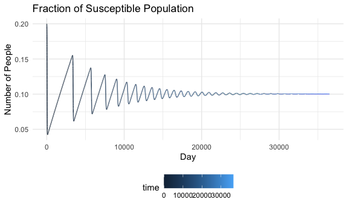
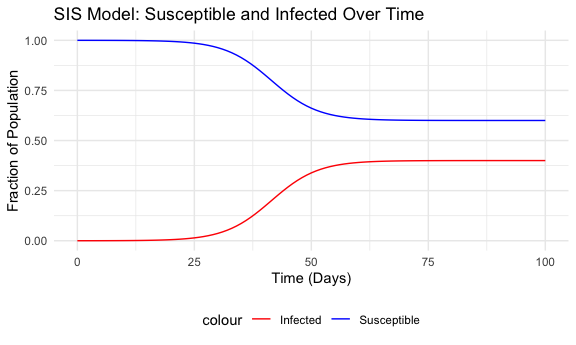

Homework 4
================

``` r
knitr::opts_chunk$set(
        echo = TRUE,
        warning = FALSE,
  fig.width = 6,
  fig.asp = .6,
  out.width = "90%"
)

theme_set(theme_minimal() +theme(legend.position = "bottom"))

options(
  ggplot2.continuous.color = "viridis",
  ggplot2.continuous.fill = "viridis"
)

scale_color_discrete = scale_colour_viridis_d
scale_fill_discrete = scale_fill_viridis_d
```

``` r
SIRdem=function(t,state,parameters){
  with(as.list(c(state,parameters)),{
    
    # rate of change
    dS=mu*N-beta*S*I/N-mu*S
    dI=beta*S*I/N-gamma*I-mu*I
    
    # return the rate of change
    list(c(dS,dI))
  }) # end with(as.list...)
}
```

# **Part 1: SIR Model with Demography**

The SIR model with demography provides a way to study endemic diseases,
in particular what proportion of the population are susceptible or
infected when the disease becomes endemic. We’ve provided the code for
both the basic SIR model with demogrpahy in the script. Do the following
simulations and report your findings.

Run both models for 100 years, using the following initial conditions: N
= 1e5 I0 = 20 S0 = 0.2 \* N beta = 520 / 365 gamma = 1 / 7 mu = 1 / 70
\* 365

``` r
N=1e5
I0=20
S0=0.2*N
state=c(S=S0,I=I0)
parameters = c(beta=520/365, gamma=1/7, mu=1/(70*365))
times=seq(0,365*100,by=1)
```

## Question 1

Plot *%I* vs *time* for both models and compare. What is the main
difference and why?

``` r
  parameters.SIR =  function(t, state, parameters){
    with(as.list(c(state, parameters)),{
      
      #rate of change
      dS = -beta * S * I / N
      dI = beta * S * I / N - gamma * I
      
      #return the rate of change
      list(c(dS, dI))
    })
  }
  
  parameters.SIRdem = function(t, state, parameters){
    with(as.list(c(state, parameters)),{
      
      #rate of change
      dS = mu * N - beta * S * I / N - mu * S
      dI = beta * S * I/N - gamma * I - mu * I
      
      #return the rate of change
      list(c(dS, dI))
    })
}
```

``` r
basic_SIR = ode(y = state, times = times, func = parameters.SIR, parms = parameters)
basic_SIR_df = as.data.frame(basic_SIR)

basic_SIR_df$S_frac = basic_SIR_df$S/N
basic_SIR_df$I_frac = basic_SIR_df$I/N
```

``` r
percent_sim = ode(y = state, times = times, func = parameters.SIRdem, parms = parameters)
percent_sim_df = as.data.frame(percent_sim)

percent_sim_df$S_frac = percent_sim_df$S / N
percent_sim_df$I_frac = percent_sim_df$I / N
```

``` r
infectious = ggplot() +
  geom_line(data = percent_sim_df, aes(x = time, y = I_frac, color = "SIR with Demography")) +
  geom_line(data = basic_SIR_df, aes(x = time, y = I_frac, color = "Basic SIR")) +
  labs(title = "Fraction of Infectious Population", 
       x = "Day",
       y = "Fraction of Infectious Population") +
  scale_color_manual(values = c("SIR with Demography" = "blue", "Basic SIR" = "red"))

infectious
```


The main differences is in the basic SIR model, the infected population
rises and falls until there are no longer people susceptible. This
assumes that once the individual is infected and recovers, that they are
no longer in the population. The SIR with demography model introduces
birth and death rates. Therefore, the susceptible population never zeros
out as new births enter the population, reaching a stable point of the
infected population.

## Question 2

What are the %S (S/N), and %I (I/N) at the end of the simulation? How
are these values (i.e. S/N, and I/N at equilibrium) compared to those
computed by the formula we derived in the class? Hint: what is R0 for
the SIR model with demography?

``` r
susceptible = ggplot(percent_sim_df, aes(x = time, y = S_frac, color = time)) +
  geom_line() +
  labs(title = "Fraction of Susceptible Population", 
       x = "Day",
       y = "Number of People")

susceptible
```



``` r
infectious + susceptible
```


# **Part 2: SIS Model**

## Question 3

Complete the SIS model \[include your code for the SIS model in your
report\]

``` r
SIS=function(t,state,parameters){
  with(as.list(c(state,parameters)),{
    # rate of change
    
    # EQUATIONS for the SIS:
    dS=-beta*S*I/N+gamma*I
    dI= beta*S*I/N-gamma*I
    
    # return the rate of change
    list(c(dS,dI))
  }) # end with(as.list...)
}
```

``` r
N=1e5
I0=10
S0=N-I0
state=c(S=S0,I=I0)
parameters=c(beta=.5,gamma=.3)

times=seq(0,100,by=1)
sim=ode(y=state,times=times,func=SIS,parms=parameters)
s=sim[,'S']/N
i=sim[,'I']/N
```

``` r
sim_df = data.frame(time = times, S = s, I = i)

ggplot(sim_df, aes(x = time)) +
  geom_line(aes(y = S, color = "Susceptible")) +
  geom_line(aes(y = I, color = "Infected")) +
  labs(title = "SIS Model: Susceptible and Infected Over Time", 
       x = "Time (Days)",
       y = "Fraction of Population") +
  scale_color_manual(values = c("Susceptible" = "blue", "Infected" = "red"))
```



## Question 4

Run the SIS model using the following initial conditions: N = 1e5 I0 =
10 S0 = N-I0 beta = 0.5 gamma = 0.3 times = 0:100

Plot *S* vs time and *I* vs time

``` r
SIS = ode(y = state, times = times, func = SIS, parms = parameters)
SIS_df = as.data.frame(SIS)
```

``` r
sis_sus = ggplot(SIS_df, aes(x = time, y = S, color = time)) +
  geom_line() +
  labs(title = "Susceptible Population", 
       x = "Day",
       y = "Number of People") 

sis_sus
```


``` r
sis_inf = ggplot(SIS_df, aes(x = time, y = I, color = time)) +
  geom_line() +
  labs(title = "Infected Population", 
       x = "Day",
       y = "Number of People") 

sis_inf
```


## Question 5

What are S/N and I/N at equilibrium? How are these values compared to
results from the formula derived from the model (I*/N = 1-1/R0 and S*/N
= 1/R0)? Hint: what is R0 for the SIS model?

``` r
R0 = parameters["beta"] / parameters["gamma"]

S_equilibrium = 1 / R0
I_equilibrium = 1 - S_equilibrium

print(S_equilibrium)
```

    ## beta 
    ##  0.6

``` r
print(I_equilibrium)
```

    ## beta 
    ##  0.4

``` r
S_last = SIS_df$S[nrow(SIS_df)] / N
I_last = SIS_df$I[nrow(SIS_df)] / N

print(S_last)
```

    ## [1] 0.6000033

``` r
print(I_last)
```

    ## [1] 0.3999967

# **Part 3: SEIR Model**

## Question 6

Code up an SEIR model based on the equations above \[provide your code
for the SEIR model in your report\].

``` r
SEIR=function(t,state,parameters){
  with(as.list(c(state,parameters)),{
    # rate of change
    
    # EQUATIONS for the SIS:
    dS = -beta * S * I / N
    dE = beta * S * I / N - sigma * E
    dI= sigma * E - gamma * I
    dR = gamma * I
    
    # return the rate of change
    list(c(dS, dE, dI, dR))
  }) # end with(as.list...)
}
```

``` r
N = 1e5
S0 = N - I0
I0 = 1
E0 = 0 
R0 = 0

beta = 520 / 365
gamma = 1 / 7
sigma = 1 / 5

state = c(S = S0, E = E0, I = I0, R = R0)
parameters = c(beta = beta, gamma = gamma, sigma = sigma)
times = seq(0, 100, by = 1)
```

``` r
seir_sim = ode(y = state, times = times, func = SEIR, parms = parameters)
seir_df = as.data.frame(seir_sim)

seir_plot = ggplot(seir_df, aes(x = time)) +
  geom_line(aes(y = S / N, color = "Susceptible")) +
  geom_line(aes(y = E / N, color = "Exposed")) +
  geom_line(aes(y = I / N, color = "Infectious")) +
  geom_line(aes(y = R / N, color = "Recovered")) +
  labs(title = "SEIR Model Simulation",
       x = "Time (days)",
       y = "Fraction of Population") +
  scale_color_manual(values = c("blue", "yellow", "red", "green")) +
  theme_minimal()

print(seir_plot)
```


## Quetsion 7

Compare S, I, Incidence, over time computed by the 2 models. What are
the differences between the two simulations?

``` r
basic_SIR_plot = ggplot() +
  geom_line(data = basic_SIR_df, aes(x = time, y = S_frac, color = "Susceptible (SIR)")) +
  geom_line(data = basic_SIR_df, aes(x = time, y = I_frac, color = "Infected (SIR)")) +
  geom_line(data = basic_SIR_df, aes(x = time, y = I, color = "Incidence (SIR)")) +
  labs(title = "Basic SIR Model: Susceptible, Infected, and Incidence Over Time",
       x = "Time (Days)", y = "Fraction of Population") +
  scale_color_manual(values = c("blue", "red", "green")) +
  theme_minimal() +
  theme(legend.position = "bottom")

# Plot for SIR model with demography
SIRdem_plot = ggplot() +
  geom_line(data = percent_sim_df, aes(x = time, y = S_frac, color = "Susceptible (SIR with Demography)")) +
  geom_line(data = percent_sim_df, aes(x = time, y = I_frac, color = "Infected (SIR with Demography)")) +
  geom_line(data = percent_sim_df, aes(x = time, y = I, color = "Incidence (SIR with Demography)")) +
  labs(title = "SIR Model with Demography: Susceptible, Infected, and Incidence Over Time",
       x = "Time (Days)", y = "Fraction of Population") +
  scale_color_manual(values = c("blue", "red", "green")) +
  theme_minimal() +
  theme(legend.position = "bottom")
```

``` r
basic_SIR_plot + SIRdem_plot
```


